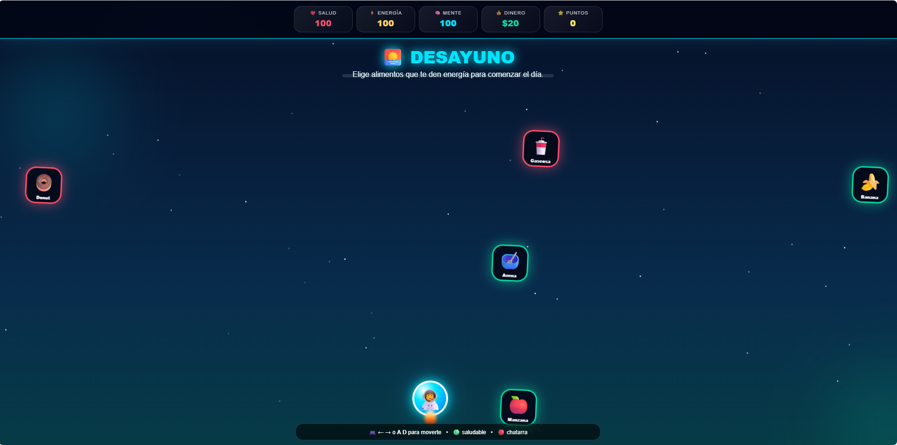

# 🍎 FOOD WARS — La Batalla por tu Plato

> **Tu plato es el campo de batalla.** Atrapa lo que te ayuda, evita lo que te perjudica y mantén tus estadísticas en equilibrio.

[🍎 JUGAR](ComidaSaludable.html) · ⚔️ Mecánicas · 📊 Estadísticas · 🧠 Aprendizaje

## 🥗 Ficha del juego
| Dato | Información |
|---|---|
| 🎮 Género | Arcade + Agilidad + Educativo |
| 🍎 Tema | Nutrición |
| 📄 Archivo | `ComidaSaludable.html` |
| 📱 Plataforma | PC + Móvil |
| 🌅 Fases | 5 momentos del día |

## ⚔️ Cómo se juega
Muévete de lado a lado para **atrapar alimentos saludables** y esquivar comida ultraprocesada. Encadena aciertos para conseguir mejores combos.

## 📊 Tus estadísticas
- ❤️ **Salud**
- ⚡ **Energía**
- 🧠 **Mente**

No basta con conseguir puntos: debes mantener un **equilibrio saludable**.

## 🌅 Las 5 fases
1. 🌞 Desayuno
2. 🏫 Recreo
3. 🍽️ Almuerzo
4. 🏃 Entrenamiento
5. 🌙 Cena

## 🕹️ Controles
- 💻 `A/D` o `⬅️/➡️`
- 📱 Botones táctiles `◀` y `▶`

## 🧠 ¿Qué aprendes?
🥦 Alimentación equilibrada · ⚡ Energía · ❤️ Salud · 🎯 Atención y reflejos

## 🚀 Ejecutar
Abre `ComidaSaludable.html`. **No requiere instalación ni internet.**
