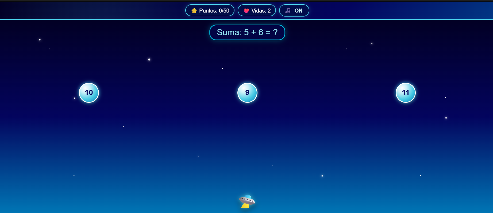
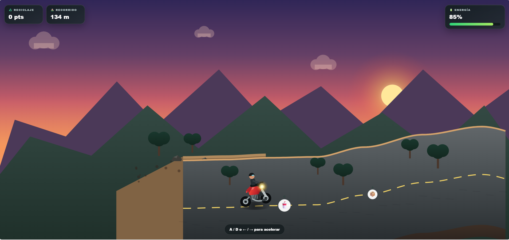
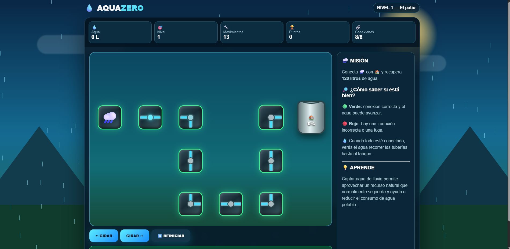
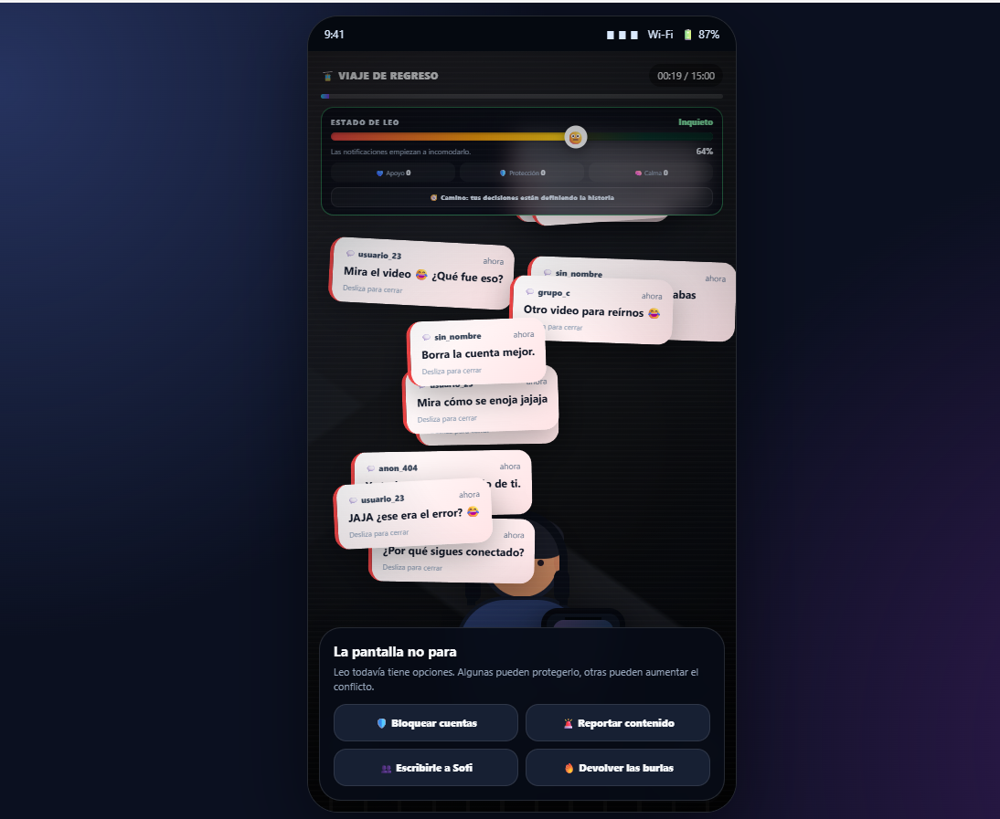
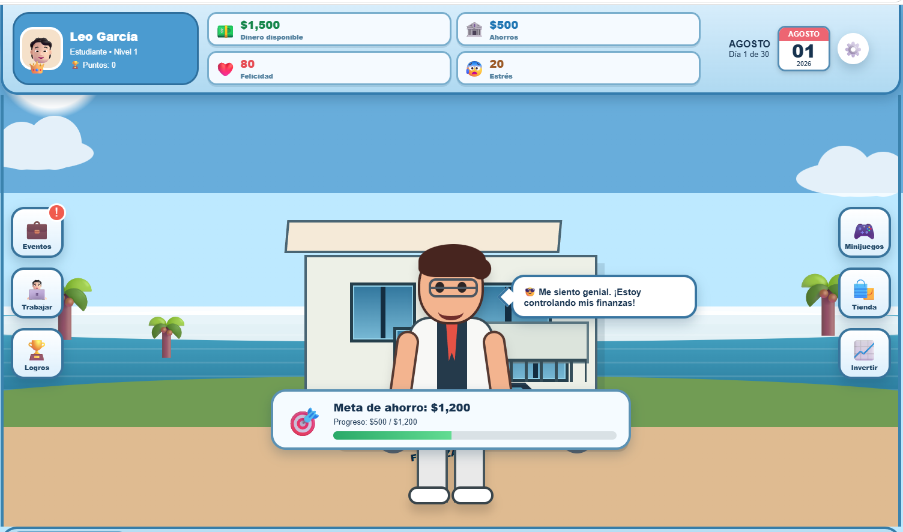

<div align="center">

# 🎮 MINIJUEGOS EDUCATIVOS & INTERACTIVOS

### 🧠 Aprende · 🎯 Juega · 🌱 Genera conciencia

Una colección de **6 experiencias web interactivas** creadas con  
**HTML5 · CSS3 · JavaScript (ES6)**.

<br>


</div>

---

## ✨ ¿Qué encontrarás aquí?

Este repositorio reúne **6 minijuegos y simuladores web** diseñados para combinar entretenimiento con aprendizaje.

| # | 🎮 Proyecto | 🧩 Tema | 📄 Archivo |
|:--:|:--|:--|:--|
| 🚀 | **Misión Estelar Matemática** | Matemáticas | `Matematica.html` |
| ♻️ | **Reci-Trail** | Reciclaje | `segundojuego.html` |
| 🍎 | **FOOD WARS** | Alimentación saludable | `ComidaSaludable.html` |
| 💧 | **AquaZero** | Cuidado del agua | `AhorrroAgua.html` |
| 📱 | **15 Minutos** | Ciberbullying | `storytelling.html` |
| 💰 | **Finanzas a la Vista** | Educación financiera | `index (1).html` |

---

# 🕹️ EXPERIENCIAS

## 🚀 01 · Misión Estelar Matemática

> 🌌 **¡Resuelve operaciones mientras pilotas una nave espacial!**

Juego de acción y reflejos donde debes atrapar la respuesta correcta de las sumas que aparecen en pantalla.

**🎯 Objetivo**
- Mover la nave de izquierda a derecha.
- Atrapar la respuesta correcta.
- Evitar respuestas incorrectas.

**❤️ Mecánica:** tienes **3 vidas**. Pierdes una vida al chocar con una respuesta errónea o dejar caer la correcta.



---

## ♻️ 02 · Reci-Trail

> 🏍️ **¡Conduce, recicla y cuida el planeta!**

Juego de conducción en moto por la montaña enfocado en la clasificación y gestión responsable de residuos.

**🎯 Objetivo**
- Conducir por el recorrido.
- Identificar plástico, cartón y vidrio.
- Colocar cada residuo en el contenedor correcto.

**⚡ Mecánica:** acelera y frena administrando tu energía. Los aciertos otorgan puntos y recargan energía; los errores consumen batería.



---

## 🍎 03 · FOOD WARS

> 🥗 **La Batalla por tu Plato**

Juego arcade basado en decisiones nutricionales y equilibrio alimenticio.

**🎯 Objetivo**
- Atrapar alimentos saludables.
- Esquivar alimentos ultraprocesados.
- Mantener equilibrados tus indicadores.

**📊 Mecánica:** administra **Salud · Energía · Mente** y consigue multiplicadores mediante combos saludables.


---

## 💧 04 · AquaZero

> 🌧️ **La Ruta del Agua**

Puzzle interactivo de tuberías enfocado en el aprovechamiento y cuidado del agua de lluvia.

**🎯 Objetivo**
- Girar las piezas.
- Crear una ruta continua.
- Llevar el agua hasta el tanque.

**💦 Mecánica:** toca las tuberías para rotarlas y forma un camino completamente conectado. ¡Cuando lo consigas, el agua comenzará a fluir!



---

## 📱 05 · 15 Minutos

> 🎭 **Storytelling Interactivo sobre Ciberbullying**

Una experiencia narrativa y visual que muestra las consecuencias del ciberbullying y la importancia de pedir apoyo.

**🎯 Objetivo**
- Acompañar a Leo durante su viaje en teleférico.
- Tomar decisiones frente a una situación difícil.
- Observar cómo cambian sus emociones.

**🎧 Mecánica:** tus decisiones afectan la experiencia. La música y la visualización cambian en tiempo real según el nivel de estrés o calma del personaje.



---

## 💰 06 · Finanzas a la Vista

> 📈 **Aprende a tomar decisiones con tu dinero**

Simulador de vida y administración financiera donde deberás equilibrar ingresos, gastos y bienestar personal.

**🎯 Objetivo**
- Alcanzar una meta de ahorro mensual.
- Administrar correctamente tus recursos.
- Tomar decisiones ante eventos inesperados.

**🎲 Mecánica:** trabaja, invierte y responde ante situaciones como emergencias o salidas con amigos. Tus niveles de **Dinero · Felicidad · Estrés · Energía** cambiarán según tus decisiones.



---

# 🛠️ TECNOLOGÍAS

<div align="center">

| Tecnología | Uso |
|:--:|:--|
| 🌐 **HTML5** | Estructura semántica de las experiencias |
| 🎨 **CSS3** | Diseño, animaciones e interfaces responsivas |
| ⚡ **JavaScript ES6** | Lógica, interacción y funcionamiento de los juegos |
| 🔊 **Web Audio API** | Sonidos y efectos de audio |

</div>

---

# 🚀 ¿CÓMO JUGAR?

### 1️⃣ Clona o descarga el repositorio

### 2️⃣ Abre cualquiera de los archivos `.html`

No necesitas instalar dependencias ni configurar un servidor.

### 3️⃣ ¡Empieza a jugar! 🎮

> 💡 **Consejo:** mantén la estructura de carpetas original para que las capturas ubicadas en `capturas/` se visualicen correctamente.

---

# 📁 ESTRUCTURA DEL PROYECTO

```text
📦 Repositorio
├── 📄 Matematica.html
├── 📄 segundojuego.html
├── 📄 ComidaSaludable.html
├── 📄 AhorrroAgua.html
├── 📄 storytelling.html
├── 📄 index (1).html
│
└── 📂 capturas
    ├── 🖼️ matematica.png
    ├── 🖼️ recitrail.png
    ├── 🖼️ foodwars.png
    ├── 🖼️ aquazero.png
    ├── 🖼️ 15minutos.png
    └── 🖼️ finanzas.png
```

---

<div align="center">

## 🌟 6 JUEGOS · 6 TEMÁTICAS · 1 EXPERIENCIA

### 🎮 ¡Aprender nunca fue tan divertido!

**Hecho con ❤️ usando HTML, CSS y JavaScript**

</div>
