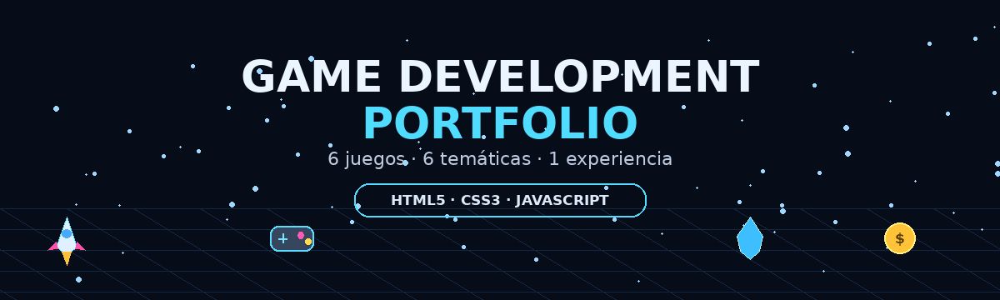

<div align="center">

# 🎮 GAME DEVELOPMENT PORTFOLIO

### 🧠 Aprende · 🎯 Juega · 💡 Experimenta




</div>

---

# 👋 SOBRE MÍ

Soy **Axel Canqui**, estudiante interesado en el desarrollo de software y en la creación de experiencias interactivas.

Este repositorio reúne los **6 videojuegos y prototipos** desarrollados durante la práctica de **Game Development**. La idea es convertir diferentes temas educativos y de concientización en experiencias que se puedan **jugar, explorar y comprender**.

🎮 **Me interesa especialmente:**
- Desarrollo de videojuegos y prototipos.
- Programación web interactiva.
- Diseño de mecánicas.
- Experiencias educativas.
- HTML, CSS y JavaScript.

> 🚀 **Mi enfoque:** aprender haciendo, probar ideas y convertirlas en experiencias jugables.

---

# ⚡ JUEGA DIRECTAMENTE

| 🎮 Proyecto | 🧩 Tema | 🎲 Género | ▶️ Jugar |
|:--|:--|:--|:--:|
| 🚀 **Misión Estelar Matemática** | Matemáticas | Arcade / Acción | [**JUGAR**](https://axl-niebla.github.io/matematicas/) |
| ♻️ **Reci-Trail** | Reciclaje | Racing / Arcade | [**JUGAR**](https://axl-niebla.github.io/recitrail/) |
| 🍎 **FOOD WARS** | Alimentación saludable | Arcade | [**JUGAR**](https://axl-niebla.github.io/foodwars/) |
| 💧 **AquaZero** | Cuidado del agua | Puzzle | [**JUGAR**](https://axl-niebla.github.io/aquazero/) |
| 📱 **15 Minutos** | Ciberbullying | Storytelling | [**JUGAR**](https://axl-niebla.github.io/15_minutos/) |
| 💰 **Finanzas a la Vista** | Educación financiera | Simulación / Gestión | [**JUGAR**](https://axl-niebla.github.io/finanzas/) |

> 🎯 Los botones **JUGAR** llevan directamente a las versiones publicadas de los videojuegos.

---

# 🎮 PROYECTOS

## 🚀 01 · MISIÓN ESTELAR MATEMÁTICA
<p align="center"></p>

> 🌌 **¡Resuelve operaciones mientras pilotas una nave espacial!**

Juego de acción y reflejos donde debes controlar una nave y atrapar la respuesta correcta.

**🎯 Objetivo:** mover la nave, atrapar respuestas correctas y evitar las incorrectas.  
**❤️ Mecánica:** tienes **3 vidas**.  
**🎲 Género:** Arcade / Acción  
**🛠️ Tecnología:** HTML5 · CSS3 · JavaScript ES6

👉 **[🚀 JUGAR AHORA](https://axl-niebla.github.io/matematicas/)**

---

## ♻️ 02 · RECI-TRAIL
<p align="center"></p>

> 🏍️ **¡Conduce, recicla y cuida el planeta!**

Juego de conducción que combina recorrido, clasificación de residuos y gestión de energía.

**🎯 Objetivo:** identificar plástico, cartón y vidrio y colocarlos correctamente.  
**⚡ Mecánica:** los aciertos dan puntos y recuperan energía; los errores consumen batería.  
**🎲 Género:** Racing / Arcade  
**🛠️ Tecnología:** HTML5 · CSS3 · JavaScript ES6

👉 **[♻️ JUGAR AHORA](https://axl-niebla.github.io/recitrail/)**

---

## 🍎 03 · FOOD WARS
<p align="center"></p>

> 🥗 **La Batalla por tu Plato**

Juego arcade basado en decisiones relacionadas con alimentación y equilibrio nutricional.

**🎯 Objetivo:** atrapar alimentos saludables y esquivar ultraprocesados.  
**📊 Mecánica:** administra **Salud · Energía · Mente** y consigue combos.  
**🎲 Género:** Arcade  
**🛠️ Tecnología:** HTML5 · CSS3 · JavaScript ES6

👉 **[🍎 JUGAR AHORA](https://axl-niebla.github.io/foodwars/)**

---

## 💧 04 · AQUAZERO
<p align="center"></p>

> 🌧️ **La Ruta del Agua**

Puzzle interactivo centrado en el aprovechamiento y cuidado del agua de lluvia.

**🎯 Objetivo:** girar las piezas, crear una ruta y llevar el agua al tanque.  
**💦 Mecánica:** rota las tuberías hasta conseguir una conexión completa.  
**🎲 Género:** Puzzle  
**🛠️ Tecnología:** HTML5 · CSS3 · JavaScript ES6

👉 **[💧 JUGAR AHORA](https://axl-niebla.github.io/aquazero/)**

---

## 📱 05 · 15 MINUTOS
<p align="center"></p>

> 🎭 **Storytelling interactivo sobre ciberbullying**

Experiencia narrativa donde las decisiones pueden modificar la experiencia del personaje.

**🎯 Objetivo:** acompañar a Leo, tomar decisiones y observar sus emociones.  
**🎧 Mecánica:** música y visualización cambian según el nivel de estrés o calma.  
**🎲 Género:** Aventura / Storytelling interactivo  
**🛠️ Tecnología:** HTML5 · CSS3 · JavaScript ES6 · Web Audio API

👉 **[📱 JUGAR AHORA](https://axl-niebla.github.io/15_minutos/)**

---

## 💰 06 · FINANZAS A LA VISTA
<p align="center"></p>

> 📈 **Aprende a tomar decisiones con tu dinero**

Simulador de vida y administración financiera donde debes equilibrar ingresos, gastos y bienestar.

**🎯 Objetivo:** alcanzar una meta de ahorro y responder a eventos inesperados.  
**🎲 Mecánica:** tus decisiones modifican **Dinero · Felicidad · Estrés · Energía**.  
**🎲 Género:** Simulación / Gestión de recursos  
**🛠️ Tecnología:** HTML5 · CSS3 · JavaScript ES6

👉 **[💰 JUGAR AHORA](https://axl-niebla.github.io/finanzas/)**

---

# 🛠️ TECNOLOGÍAS

| Tecnología | Uso |
|:--:|:--|
| 🌐 **HTML5** | Estructura |
| 🎨 **CSS3** | Diseño, interfaces y animaciones |
| ⚡ **JavaScript ES6** | Lógica y mecánicas |
| 🔊 **Web Audio API** | Audio y efectos |
| 🚀 **GitHub Pages** | Publicación de los juegos |

---

# 🤖 USO DE INTELIGENCIA ARTIFICIAL

Se utilizó apoyo de herramientas de IA en tareas relacionadas con **ideación, programación, revisión y documentación**.

La IA se utilizó como herramienta de apoyo; las ideas, adaptación, pruebas, correcciones y organización del proyecto forman parte del proceso de desarrollo.


---

# 🧠 ¿QUÉ APRENDÍ?

- Convertir una idea en una mecánica jugable.
- Crear interacciones con JavaScript.
- Construir interfaces con HTML y CSS.
- Diseñar objetivos y reglas.
- Utilizar vidas, puntos, recursos y decisiones.
- Crear experiencias educativas mediante videojuegos.
- Organizar varios proyectos en un mismo repositorio.
- Publicar prototipos web para que otras personas puedan jugarlos.

---

# 🔧 ¿QUÉ MEJORARÍA?

- 🎨 Unificar aún más la identidad visual.
- 🎮 Añadir niveles y desafíos.
- 🏆 Incorporar récords y puntuaciones.
- 🔊 Mejorar sonidos y música.
- 📱 Optimizar la adaptación a diferentes pantallas.
- 🧩 Añadir nuevas mecánicas y eventos.
- 💾 Incorporar progreso y guardado cuando sea necesario.

---

# 📁 ESTRUCTURA DEL PROYECTO

```text
📦 GAME-DEVELOP
│
├── 📂 15 MINUTOS
├── 📂 AQUAZERO
├── 📂 FINANZAS A LA VISTA
├── 📂 FOOD WARS
├── 📂 MISION ESTELAR
├── 📂 RECI-TRAIL
│
├── 📂 capturas
│   ├── 🖼️ matematica.png
│   ├── 🖼️ recitrail.png
│   ├── 🖼️ foodwars.png
│   ├── 🖼️ aquazero.png
│   ├── 🖼️ 15minutos.png
│   ├── 🖼️ finanzas.png
│   └── 🎞️ banner_game_dev.gif
│
├── 📄 README.md
└── 📄 README prueba.md
```

---

# 🧭 EXPLORA

🎮 **[🚀 Misión Estelar](https://axl-niebla.github.io/matematicas/)** ·
**[♻️ Reci-Trail](https://axl-niebla.github.io/recitrail/)** ·
**[🍎 Food Wars](https://axl-niebla.github.io/foodwars/)** ·
**[💧 AquaZero](https://axl-niebla.github.io/aquazero/)** ·
**[📱 15 Minutos](https://axl-niebla.github.io/15_minutos/)** ·
**[💰 Finanzas](https://axl-niebla.github.io/finanzas/)**


---

<div align="center">

# 🌟 6 JUEGOS · 6 TEMÁTICAS · 1 PORTAFOLIO

### 🎮 Convertir ideas en experiencias jugables.

**Game Development Portfolio · 2026**

</div>
